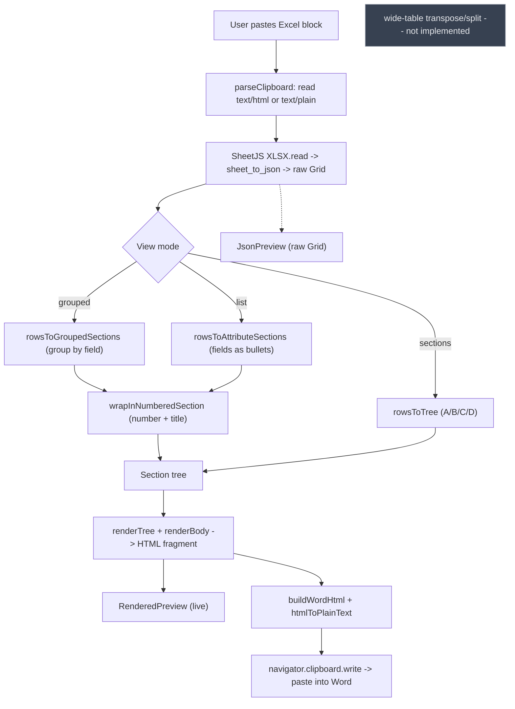

# Architecture

## Core data model

The product is a **section tree**, not a flat table. Everything is built around this shape (see [`lib/types.ts`](../lib/types.ts)):

```ts
Section {
  number: string        // "5" for the wrapper heading (grouped/per-item); "" for A/B/C/D
  title: string         // "Fruit Database" (wrapper) / a group value / an item name
  children: Subsection[]
  body?: Body            // optional: content rendered directly under the section heading
}

Subsection {
  number: string        // "5.1", "5.2", … for wrapped views; "" for A/B/C/D
  title: string
  body: Body
}

Body =
  | { type: "text", content: string }
  | { type: "bullets", items: string[] }
  | { type: "table", rows: string[][] }
```

`Section.body` lets a section carry content directly (used by the grouped and per-item views, which emit one bullet list per section). The A/B/C/D view instead puts bodies on `Subsection`s. The parser produces a raw **Grid** (`Cell[][]`) which a mapper turns into the tree.

## View modes (how a Grid becomes a tree)

The pasted Grid is mapped to a section tree by one of three mappers, selected in the UI (`components/PasteInput.tsx`). Default is **Grouped by field**.

### 1. Grouped by field — `rowsToGroupedSections` (default)
Row 0 is field names. Rows are grouped by a chosen **group column**; each distinct value becomes a section heading, and the rows that share it are listed as bullets. Each bullet is a **label column** value plus, optionally, a parenthetical of other checked fields.

```
Brazil
- Apple (Winter, Low)
- Raspberry (Winter, Low)
USA
- Grape (Year-round, High)
```
Blank group cell → `(blank)` bucket; blank label → `(untitled)` (no row is dropped). First-seen group order and within-group row order are preserved.

### 2. Fields as bullets — `rowsToAttributeSections` (per-item / transpose)
Row 0 is field names. Each later row becomes a section titled by a chosen **title column**, with the other selected columns as `Field: value` bullets.

```
Apple
- ID: UPC86921
- Origin: Brazil
```

### 3. A/B/C/D sections — `rowsToTree` (original position convention)

| Column | Role |
| ------ | ---- |
| **A** filled | New **section** title |
| **A** blank  | Subsection of the section above |
| **B**        | Subsection title |
| **C**        | Body content |
| **D**        | Body type flag — `text`, `bullet`, or `table` |

This is the only view that can produce a `table` body (when D = `table`, C is split on newlines/tabs). Blank cells are preserved as `""` during parsing so the A/B/C/D positions stay aligned.

The grouped and per-item views are header-aware (row 0 = field names) and share a **field checklist** for choosing which columns appear.

## Data flow

```
clipboard (text/html, else text/plain)
  -> SheetJS XLSX.read({ type: "string" })
  -> sheet_to_json({ header: 1, blankrows: false, defval: "", raw: false })   -> raw Grid
  -> mapper (rowsToGroupedSections | rowsToAttributeSections | rowsToTree)     -> Section[]
  -> wrapInNumberedSection (grouped/per-item only: one numbered, titled section) -> Section tree
  -> renderTree (renderBody per text / bullets / table)                        -> HTML fragment
  -> live preview (RenderedPreview, dangerouslySetInnerHTML)
  -> buildWordHtml + htmlToPlainText -> navigator.clipboard.write             -> paste into Word
```

`renderTree` escapes all user-derived text (`& < >`) and omits blank `number`s, so headings render as plain titles today. The JSON view shows the raw Grid instead of the rendered tree.

## Numbering

`lib/numbering.ts` exports `wrapInNumberedSection(items, sectionNumber, sectionTitle)`: it wraps the grouped/per-item output under one top-level section (the user-chosen number + title, e.g. `5 Fruit Database`) whose children are numbered `5.1`, `5.2`, … (1-based). It returns a fresh tree and is pure. The **A/B/C/D** view is not wrapped (it is already two levels deep). `renderTree` renders the numbers as-is and omits any that are blank.

## Not currently wired in

- **Wide-table width strategy.** Transpose/split so a wide table fits a Letter page is **not** implemented. It is largely moot for the grouped/per-item views (they emit narrow bullet lists, not tables); it only matters for the A/B/C/D view's `table` bodies. Page-fit today comes from the content being narrow block flow, reinforced by `buildWordHtml`'s `@page` + `overflow-wrap` hints.
- **`.docx` generation.** Out of scope; export is HTML-on-clipboard only.

## Clipboard output

`lib/clipboard.ts` wraps the rendered fragment for Word:
- `buildWordHtml(fragment)` → `<!DOCTYPE html>…<meta charset="utf-8"><style>@page{size:8.5in 11in;margin:1in}body{overflow-wrap:break-word}</style>…<body>{fragment}</body>`. Bare `<h2>/<h3>/<ul>` tags map onto Word's native Heading/List styles; the browser writes the Windows CF_HTML header automatically.
- `htmlToPlainText(fragment)` → readable `- Field: value` fallback for the `text/plain` flavor.

`PasteInput.copyForWord()` writes a `ClipboardItem` with both flavors via `navigator.clipboard.write`.

## Pipeline diagram


