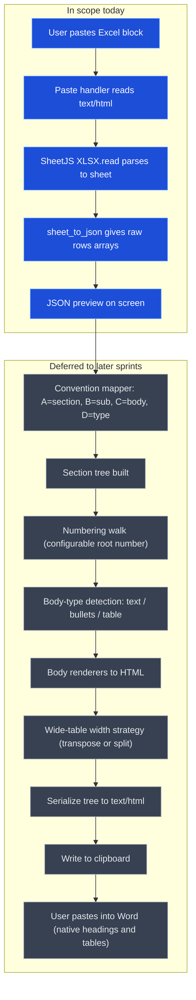

# Architecture

## Core data model

The product is a **section tree**, not a flat table. Everything is built around this shape (see [`lib/types.ts`](../lib/types.ts)):

```ts
Section {
  number: string      // "6", generated
  title: string       // "FRUIT"
  children: Subsection[]
}

Subsection {
  number: string      // "6.1", generated
  title: string       // "Fruit Description"
  body: Body
}

Body =
  | { type: "text", content: string }
  | { type: "bullets", items: string[] }
  | { type: "table", rows: string[][] }
```

Today's parser produces a simpler intermediate — a raw **Grid** (`Cell[][]`) — which the (deferred) convention mapper will turn into the tree above.

## Input convention (MVP)

The user pastes a block where **column position defines role**:

| Column | Role |
| ------ | ---- |
| **A** filled | New **section** title |
| **A** blank  | Subsection belongs to the section above |
| **B**        | Subsection title |
| **C**        | Body content |
| **D**        | Body type flag — `text`, `bullet`, or `table` |

Blank cells are preserved as `""` during parsing so these column positions stay aligned.

## Data flow

```
clipboard (text/html)
  -> SheetJS XLSX.read({ type: "string" })
  -> sheet_to_json({ header: 1 })            <- raw Grid (today stops here)
  -> convention mapper (A/B/C/D)             -> Section tree
  -> numbering walk (configurable root)      -> numbered tree
  -> body renderers (text / bullets / table) -> HTML fragments
  -> wide-table width strategy               -> page-fitting tables
  -> serialize tree to text/html -> clipboard -> paste into Word
```

## Finished-MVP walkthrough

When complete, the user will:

1. Paste an Excel block into the app.
2. The app parses it to raw rows.
3. A convention mapper turns rows into the section tree (A = section, B = sub, C = body, D = type).
4. Numbering walks the tree and assigns dotted numbers from a configurable root (start at 6 -> 6, 6.1, 6.2).
5. Body renderers convert each body to HTML (text, bullets, or table).
6. Wide tables get a width strategy (transpose or split) so they fit a Word page.
7. The user copies the result to the clipboard as `text/html`.
8. Pasting into Word produces native numbered headings and tables.

Example target output:

```
6 FRUIT
6.1 Fruit Description
   (table or bullets)
6.2 Fruit Text
   (table or description)
```

## Pipeline diagram

Blue nodes are **in scope today**; grey nodes are **deferred to later sprints**.


