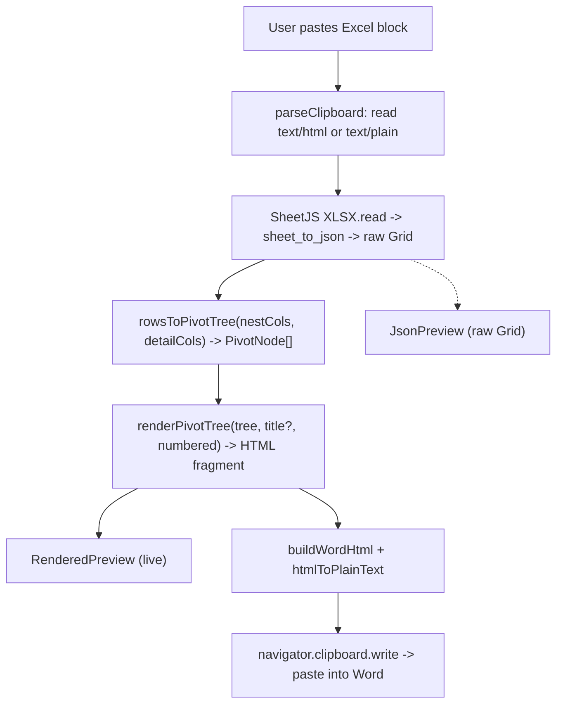

# Architecture

## Core data model

The product is a recursive **pivot tree**, not a flat table (see [`lib/types.ts`](../lib/types.ts)):

```ts
PivotNode {
  title: string          // "Item Name: Apple" (Field name: value)
  children: PivotNode[]   // leaf = []
  details?: string[]      // leaf "Field: value" detail lines (body text)
}
```

The parser produces a raw **Grid** (`Cell[][]`); `rowsToPivotTree` turns it into a `PivotNode` tree of arbitrary depth. Shared value-paths merge; a leaf may carry `details` (the non-nested fields). Only the optional title is a heading — everything else is styled body text.

Multiple pasted tables are held as a `TableState[]` in `components/PasteInput.tsx`; each `TableState` carries its own grid, `pivotOrder` (nesting fields), `selectedCols` (detail fields), `pivotNumbered`, and `sectionTitle`. `components/tableModel.ts` `tableToHtml(t)` runs the per-table nest→render pipeline and is the single source used by both the card preview and the combined export.

## The pivot view (how a Grid becomes a tree) — `rowsToPivotTree`

Row 0 is field names. You pick an **ordered** list of **Nest by** fields; rows nest by that order — field 1 is the outermost grouping, within each group nest by field 2, and so on. Each level is labelled `Field name: value` (the field name comes from that column's header). Rows sharing a value-path **merge** (a pivot with only Row fields, no Values), so duplicate paths collapse. A separate **Detail fields** checklist picks columns shown as flat `Field: value` lines under each leaf item (not nesting levels); merged leaves stack each row's detail block. A **Number levels** toggle prefixes `1./a./i.` markers by depth (restarting per parent). Blank cell → `(blank)`; first-seen order preserved at every level.

```
1. Item Category: Fruit
   a. Item Name: Apple
        Item Location: Aisle 5      (detail line, body text)
        Item Description: Lorem…
   b. Item Name: Banana
        …
2. Item Category: Meat
   …
```

Output is a `PivotNode[]` (arbitrary depth; leaves carry optional `details`). Only an optional **Section title** is a real Word heading (rendered as `<h2>` → Heading 1); the nested rows are styled, indented body paragraphs (`<p data-level="N">`, depth clamped at 9) and the detail lines are plain indented `<p>` — all out of Word's navigation outline. With a title the nested data starts at level 2; without one, level 1 with no heading. The ordered field picker records selection order (numbered badges + legend + ▲/▼ reorder).

## Data flow

```
clipboard (text/html, else text/plain)
  -> SheetJS XLSX.read({ type: "string" })
  -> sheet_to_json({ header: 1, blankrows: false, defval: "", raw: false })   -> raw Grid  (append a TableState)
  -> tableToHtml(t):
       rowsToPivotTree(grid, nestCols, detailCols)
         -> renderPivotTree(tree, title?, numbered)                           -> HTML fragment
  -> live preview (RenderedPreview, dangerouslySetInnerHTML; scoped h2 + [data-level] CSS)
  -> buildWordHtml + htmlToPlainText -> navigator.clipboard.write             -> paste into Word
```

Per-table **Copy for Word** runs `tableToHtml` for that one table; combined **Copy all** joins every table's fragment and runs **one** `buildWordHtml` (valid because its rewrites are global regexes and it emits a single `@page`). `renderPivotTree` escapes all user-derived text (`& < >`). The JSON view shows the raw Grid instead of the rendered tree.

## Clipboard output

`lib/clipboard.ts` wraps the rendered fragment for Word and applies the styling:
- `buildWordHtml(fragment, heading, bodyFont)` → an Office-namespaced `<html>` with a `<style>` (`@page`, body font, heading rules) and `<body>{rewritten fragment}`. It rewrites the `<h2>` title → `<p class="MsoHeading1">` (a real Word heading: `mso-style-name:"heading 1"` + `mso-outline-level:1`, so it appears in the outline), and pivot `<p data-level="N">` → `MsoPiv1..9` (**non-heading** styled paragraphs — no `mso-style-name`/`mso-outline-level`, just the per-level look + a growing left indent, so they stay out of the outline). Detail `<p style=...>` lines pass through untouched as body text. Every look comes from `heading.levels[N-1]`. The browser writes the Windows CF_HTML header automatically.
- `htmlToPlainText(fragment)` → readable plain-text fallback for the `text/plain` flavor.

`HeadingStyle = { levels: LevelStyle[] }` is the single styling source, built once in `PasteInput` and shared by every table — Level 1 styles `MsoHeading1` (the pivot title), Levels 2-9 the nested rows by depth. The card's `copyForWord()` and the parent's `copyAll()` write a `ClipboardItem` with both flavors via `navigator.clipboard.write`. Export is clipboard-only (no download).

## Out of scope

- **`.docx` generation** — export is HTML-on-clipboard only.

## Pipeline diagram


