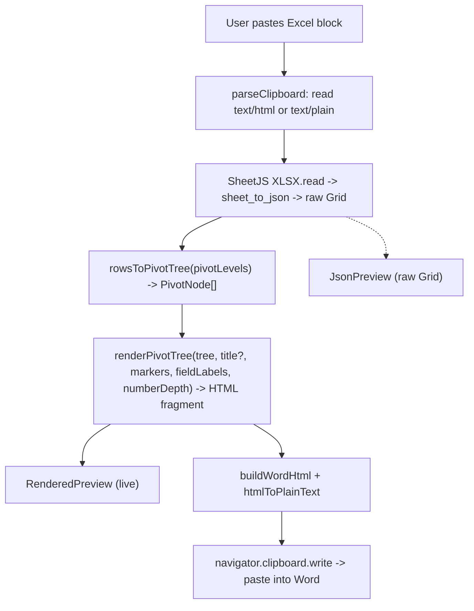

# Architecture

## Core data model

The product is a recursive **pivot tree**, not a flat table (see [`lib/types.ts`](../lib/types.ts)):

```ts
PivotNode {
  lines: PivotLine[]      // the fields at one indent level (>=1, stacked)
  children: PivotNode[]   // leaf = []
}
PivotLine { col, name, value }   // label `name` (header) + `value`, kept SEPARATE + raw
```

The parser produces a raw **Grid** (`Cell[][]`); `rowsToPivotTree` turns it into a `PivotNode` tree of arbitrary depth. The pivot structure is an ordered list of **indent buckets** — each bucket is one indent level holding one or more fields. A node's `lines` are that level's fields stacked at the same indent (each keeps its label `name` and `value` separate so the renderer can show/hide/format the label); rows whose values match across all of a level's fields merge into one node (composite group key). The title and the top-N numbered levels are Word headings; everything else is styled body text.

Multiple pasted tables are held as a `TableState[]` in `components/PasteInput.tsx`; each `TableState` carries its own grid, `pivotLevels` (`number[][]` — the ordered indent buckets), `markers`, `fieldLabels` (`Record<col, FieldLabel>` — per-field label show/bold/underline), and `sectionTitle`. A shared `numberDepth` (how many top levels become Word headings) lives in `PasteInput`. `components/tableModel.ts` `tableToHtml(t, numberDepth)` runs the per-table nest→render pipeline and is the single source used by both the card preview and the combined export — both pass `numberDepth`.

## The pivot view (how a Grid becomes a tree) — `rowsToPivotTree`

Row 0 is field names. You arrange fields into an **ordered list of indent buckets** (`pivotLevels: number[][]`): bucket 1 is the outermost level, within each group nest by bucket 2, and so on. A bucket can hold **one or more** fields — fields stacked in one bucket render at the same indentation and form a **composite group key**, so rows merge into one node only when they match across every field in that bucket. Each line is labelled `Field name: value`; per field, the label (`Field name: `) can be hidden, bolded, or underlined (`fieldLabels`), leaving just the value. A per-level **Markers** picker chooses each level's bullet/number style; only the first field of a multi-field level is marked. The top **`numberDepth`** levels instead become real Word headings (see below) and Word numbers them. Blank cell → `(blank)`; first-seen order preserved at every level.

```
1. Item Category: Fruit
   a. Item Name: Apple
        i. Item Qty: 16             ← bucket 3 holds three fields,
           UID: AVASCASC               stacked at one indent
           Item Description: Lorem…
   b. Item Name: Banana
        …
2. Item Category: Meat
   …
```

Output is a `PivotNode[]` (arbitrary depth; each node carries its level's `lines`). The optional **Section title** renders as `<p class="ws-title">` and the nested rows as `<p class="ws-lvl" data-level="N">` (depth clamped at 9); a numbered level's first line also gets `data-heading="K"`. `buildWordHtml` maps the **title** and the **numbered levels** to the destination document's `Heading 1`/`Heading K` styles when set (a Use-Destination-Styles paste then adopts the template's headings + live numbering — `5.0 / 5.1 / 5.1.1`); every other body row uses the app's direct per-level styling, so the Word output matches the live preview. With a title the nested data starts at level 2; without one, level 1. The Structure picker builds the buckets (Add-fields pool plus ◄ outdent / ► indent / ▲ ▼ reorder / ✕ remove) and the per-field label toggles (Aa show/hide, B bold, U underline).

## Data flow

```
clipboard (text/html, else text/plain)
  -> SheetJS XLSX.read({ type: "string" })
  -> sheet_to_json({ header: 1, blankrows: false, defval: "", raw: false })   -> raw Grid  (append a TableState)
  -> tableToHtml(t, numberDepth):
       rowsToPivotTree(grid, pivotLevels)
         -> renderPivotTree(tree, title?, markers, fieldLabels, numberDepth)  -> HTML fragment
  -> live preview (RenderedPreview, dangerouslySetInnerHTML; scoped [data-level] + [data-heading] CSS)
  -> buildWordHtml + htmlToPlainText -> navigator.clipboard.write             -> paste into Word
```

Per-table **Copy for Word** runs `tableToHtml` for that one table; combined **Copy all** joins every table's fragment and runs **one** `buildWordHtml` (valid because its rewrites are global regexes and it emits a single `@page`). `renderPivotTree` escapes all user-derived text (`& < >`). The JSON view shows the raw Grid instead of the rendered tree.

## Clipboard output

`lib/clipboard.ts` wraps the rendered fragment for Word and applies the styling:
- `buildWordHtml(fragment, heading, bodyFont)` → an Office-namespaced `<html>` with a `<style>` (`@page`, body font, the mapped-title + numbered-heading rules) and `<body>{rewritten fragment}`. **The title:** when `headingStyleName` is set it becomes `<p class="MsoTitle">` + a `mso-style-name:"<name>";mso-outline-level:1` rule (destination heading + its numbering on a Use-Destination-Styles paste); blank → the app's direct level-1 look inline. **Numbered levels** (`data-heading="K"`): each becomes `<p class="MsoHeadingK">` + a `p.MsoHeadingK{mso-style-name:"Heading K";mso-outline-level:K}` rule, so Word numbers them live. **Every other body row:** a `<p>` with **inline** direct formatting — `heading.levels[N-1]` (color/font/size) + left-indent + compact spacing (`margin:0`, `line-height:115%`) — with `<b>`/`<u>` runs for the label per `fieldLabels`. Inline (not a CSS class) is the key for non-mapped paragraphs: a Use-Destination-Styles paste discards class/style-name formatting it can't map (resetting unknown classes to Normal, dropping bold and bringing Normal's space-after) but keeps inline direct formatting + inline runs, so the per-level look, tight spacing, and label bold/underline survive and match the live preview. The browser writes the Windows CF_HTML header automatically.
- `htmlToPlainText(fragment)` → readable plain-text fallback for the `text/plain` flavor.

`HeadingStyle = { levels: LevelStyle[]; indentStep: number; headingStyleName: string }` is the single styling source, built once in `PasteInput` and shared by every table — `headingStyleName` is the Word style name for the title (default `Heading 1`; blank = the app's direct level-1 look), `levels` is the direct per-level look (Arial 11 black) used for non-numbered body rows (and the title when unmapped), and `indentStep` (inches) is the left-indent per nesting level. The shared `numberDepth` (how many top levels become Word headings) is passed to `tableToHtml`. The card's `copyForWord()` and the parent's `copyAll()` write a `ClipboardItem` with both flavors via `navigator.clipboard.write`. Export is clipboard-only (no download).

## Out of scope

- **`.docx` generation** — export is HTML-on-clipboard only.

## Pipeline diagram


