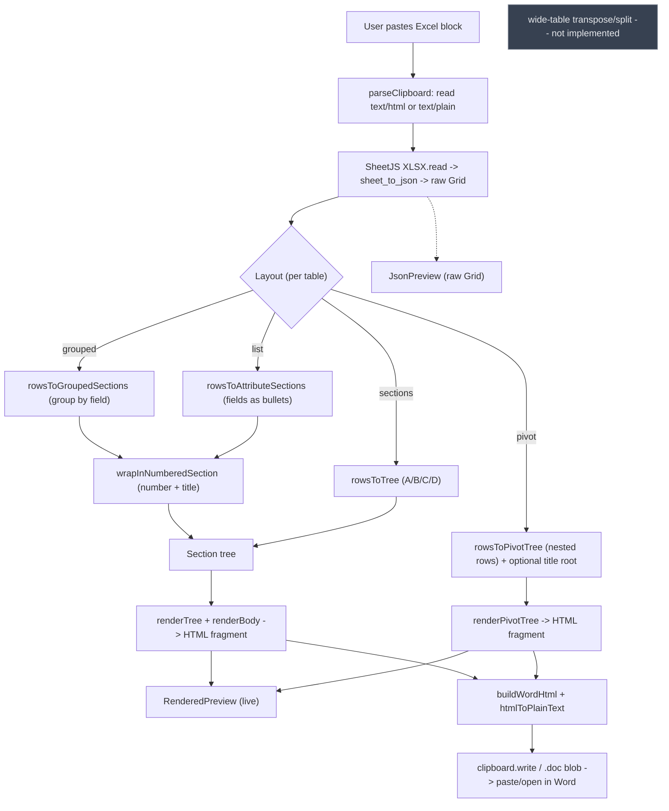

# Architecture

## Core data model

The product is a **section tree**, not a flat table. Everything is built around this shape (see [`lib/types.ts`](../lib/types.ts)):

```ts
Section {
  number: string        // "5" for the wrapper heading (grouped/per-item); "" for A/B/C/D
  title: string         // "Fruit Database" (wrapper) / a group value / an item name
  children: Subsection[]
  body?: Body            // optional: content rendered directly under the section heading
}

Subsection {
  number: string        // "5.1", "5.2", … for wrapped views; "" for A/B/C/D
  title: string
  body: Body
}

Body =
  | { type: "text", content: string }
  | { type: "bullets", items: string[] }
  | { type: "table", rows: string[][] }

PivotNode {              // pivot view only — arbitrary depth
  title: string
  children: PivotNode[]  // leaf = []
}
```

`Section.body` lets a section carry content directly (used by the grouped and per-item views, which emit one bullet list per section). The A/B/C/D view instead puts bodies on `Subsection`s. The **pivot** view is the exception to the 2-level model: it builds a recursive `PivotNode` tree (no body, no number) of arbitrary depth, rendered as nested Word headings (depth → Heading 1..9). The parser produces a raw **Grid** (`Cell[][]`) which a mapper turns into the tree.

Multiple pasted tables are held as a `TableState[]` in `components/PasteInput.tsx`; each `TableState` carries its own grid, layout, column choices, pivot order, and title. `components/tableModel.ts` `tableToHtml(t)` runs the per-table map→render pipeline and is the single source used by both the card preview and the combined export.

## View modes (how a Grid becomes a tree)

Each table's Grid is mapped to a tree by one of four mappers, chosen per table in its card (`components/TableCard.tsx`). Default is **Grouped by field**.

### 1. Grouped by field — `rowsToGroupedSections` (default)
Row 0 is field names. Rows are grouped by a chosen **group column**; each distinct value becomes a section heading, and the rows that share it are listed as bullets. Each bullet is a **label column** value plus, optionally, a parenthetical of other checked fields.

```
Brazil
- Apple (Winter, Low)
- Raspberry (Winter, Low)
USA
- Grape (Year-round, High)
```
Blank group cell → `(blank)` bucket; blank label → `(untitled)` (no row is dropped). First-seen group order and within-group row order are preserved.

### 2. Fields as bullets — `rowsToAttributeSections` (per-item / transpose)
Row 0 is field names. Each later row becomes a section titled by a chosen **title column**, with the other selected columns as `Field: value` bullets.

```
Apple
- ID: UPC86921
- Origin: Brazil
```

### 3. Pivot (nested rows) — `rowsToPivotTree`
Row 0 is field names. You pick an **ordered** list of fields; rows nest by that order — field 1 is the outermost grouping, within each group nest by field 2, and so on. Rows sharing a value-path **merge** (a pivot with only Row fields, no Values), so duplicate paths collapse. Blank cell → `(blank)`; first-seen order preserved at every level.

```
Brazil
  Winter
    Apple
Mexico
  Spring
    Cantaloupe
```
Output is a `PivotNode[]` of arbitrary depth, rendered as nested headings (depth → Heading 1..9, clamped at 9). Plain (un-numbered); an optional **Section title** becomes a synthetic root node (the title is level 1; groups shift to level 2+). An ordered field picker records selection order (numbered badges + legend + ▲/▼ reorder).

### 4. A/B/C/D sections — `rowsToTree` (original position convention)

| Column | Role |
| ------ | ---- |
| **A** filled | New **section** title |
| **A** blank  | Subsection of the section above |
| **B**        | Subsection title |
| **C**        | Body content |
| **D**        | Body type flag — `text`, `bullet`, or `table` |

This is the only view that can produce a `table` body (when D = `table`, C is split on newlines/tabs). Blank cells are preserved as `""` during parsing so the A/B/C/D positions stay aligned.

The grouped and per-item views are header-aware (row 0 = field names) and share a **field checklist** for choosing which columns appear.

## Data flow

```
clipboard (text/html, else text/plain)
  -> SheetJS XLSX.read({ type: "string" })
  -> sheet_to_json({ header: 1, blankrows: false, defval: "", raw: false })   -> raw Grid  (append a TableState)
  -> tableToHtml(t):
       grouped|list -> mapper -> wrapInNumberedSection -> renderTree           -> HTML fragment
       sections     -> rowsToTree -> renderTree                                -> HTML fragment
       pivot        -> rowsToPivotTree (+ optional title root) -> renderPivotTree -> HTML fragment
  -> live preview (RenderedPreview, dangerouslySetInnerHTML; scoped h2/h3 + [data-level] CSS)
  -> buildWordHtml + htmlToPlainText -> navigator.clipboard.write / .doc blob  -> paste/open in Word
```

Per-table Copy/Download run `tableToHtml` for that one table; combined **Copy all / Download all** join every table's fragment and run **one** `buildWordHtml` (valid because its heading rewrites are global regexes and it emits a single `@page`). `renderTree`/`renderPivotTree` escape all user-derived text (`& < >`) and omit blank `number`s. The JSON view shows the raw Grid instead of the rendered tree.

## Numbering

`lib/numbering.ts` exports `wrapInNumberedSection(items, sectionNumber, sectionTitle)`: it wraps the grouped/per-item output under one top-level section (the user-chosen number + title, e.g. `5 Fruit Database`) whose children are numbered `5.1`, `5.2`, … (1-based). It returns a fresh tree and is pure. The **A/B/C/D** view is not wrapped (it is already two levels deep). `renderTree` renders the numbers as-is and omits any that are blank.

## Not currently wired in

- **Wide-table width strategy.** Transpose/split so a wide table fits a Letter page is **not** implemented. It is largely moot for the grouped/per-item views (they emit narrow bullet lists, not tables); it only matters for the A/B/C/D view's `table` bodies. Page-fit today comes from the content being narrow block flow, reinforced by `buildWordHtml`'s `@page` + `overflow-wrap` hints.
- **`.docx` generation.** Out of scope; export is HTML-on-clipboard only.

## Clipboard output

`lib/clipboard.ts` wraps the rendered fragment for Word and applies the heading styling:
- `buildWordHtml(fragment, heading, bodyFont)` → an Office-namespaced `<html>` with a `<style>` (`@page`, body font, heading rules) and `<body>{rewritten fragment}`. It rewrites `<h2>`→`<p class="MsoHeading1">`, `<h3>`→`MsoHeading2`, and pivot `<p data-level="N">`→`MsoPiv1..9`. Each Mso* class carries `mso-style-name:"heading N"` + `mso-outline-level:N` (so Word treats them as native Heading 1..9 in the outline) plus the look from `HeadingStyle` — color/font/size/bold, and for pivot a per-level `LevelStyle` + a growing left indent. The browser writes the Windows CF_HTML header automatically.
- `htmlToPlainText(fragment)` → readable plain-text fallback for the `text/plain` flavor.

`HeadingStyle` (color, font, h1/h2 size, bold, `levels: LevelStyle[]`) is built once in `PasteInput` and shared by every table; `LevelStyle[]` holds the shared per-pivot-level look. The card's `copyForWord()` / parent's `copyAll()` write a `ClipboardItem` with both flavors via `navigator.clipboard.write`; `downloadForWord()` / `downloadAll()` save the same HTML as a `.doc`.

## Pipeline diagram


